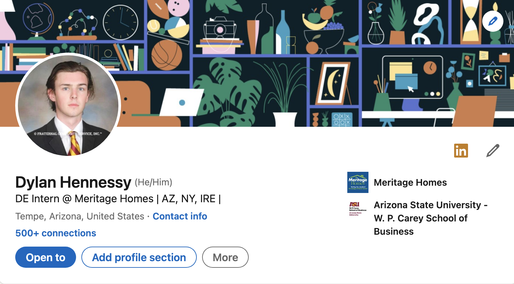
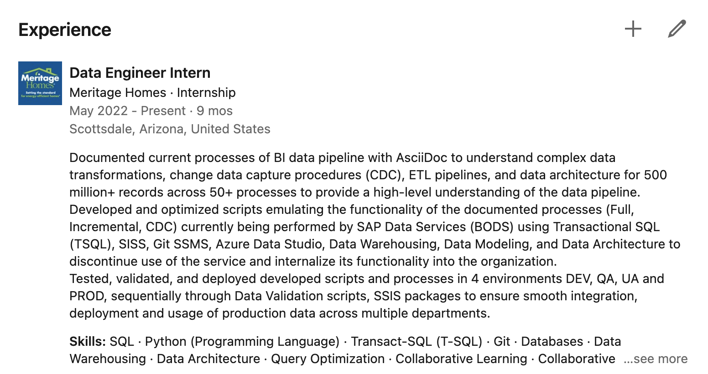

= Linkedin Basics and Resources
Dylan Hennessy <hennessydylan@outlook.com>
v1.7, 2023-01-16

== What is Linkedin?
*A Job board trying to be a social media.* When you apply to a job normally, what that determines whether or not they will recommend you as a candidate is a piece of software that auto reads, grades and recommends applications out of usually tens of thousands. When you apply through Linkedin directly they have a much large ai that takes into account a lot more data of what you do on the site, essentially everything, and then that ai decides if you are a good applicant, then either recommends you as a top applicant or it throws it out and no one at the company ever sees it. General rule of thumb *is to have Linkedin like you as a user, meaning fill out your full profile and interacting on posts*, and they will recommend you to jobs and internships you may never had a shot for. *The more you use Linkedin like a social media the more the are going to recommend you for jobs applied for directly through their site*, its a pretty pediculous concept but they are trying to be a social media for some reason.

== Why have a good LinkedIn?
In General:: The most popular way now to place anyone for any type of competitive job is through working with a recruiter from that specific company, cold applying unless you are a top applicant from an ivy isn't going to get you anywhere in most cases. *I assume all KAs will kill interviews, generally socially and just speaking wise we are better mostly everyone applying, our goal is to get there.* With that, reaching out and building a relationships with these recruiters, and just having the person like you decides whether or not you'll get hired or even interviewed. How you setup your resume, Linkedin all of it just gets us there, if you have a blank Linkedin there is not much worth in reaching out. You wouldn't reply to a blank instagram account that dms you right? *A good profile is a tool to meet a build relationships with people where you want to work now and in the future, as well as get us an interview.*

== Important aspects
Professional Photo:: It is common to just use your fraternity composite as your profile photo.
Profile Header:: Fill out all your necessary information, this will be seen under your name on all your Linkedin interactions so don't make it unprofessional. You can follow my format below or just use "Position at company", just have some personality in it.

.Profile Photo & Header Example
[%collapsible]
====

====

Summary Section:: Your summary section is very important but it is something that is personalized and that you need to write yourself. Keep it professional, you can take the route of finding a template for it online as well https://www.themuse.com/advice/5-templates-thatll-make-writing-the-perfect-linkedin-summary-a-breeze[here]. But I really think you should just write about what you actually like and who you are, its good practice for how you open your interviews and you can write it just like that. Companies actually like personality and hearing about who you are, when you get to the interviews, not because they really care about the company values or any of that, *they just want to know if they like you, people just want to work with people they're cool with.*
Resume/Previous Experience:: *This is the most important part of applying to any job, and not getting auto rejected.* One if you have a terrible resume just ask for some help on formatting it or use a template that doesn't look terrible that is the first step, and get the basics on it. If you've never had a job, and have nothing to put on there get a grip. Next is your jobs descriptions, I struggled actually finding a good resource on how to write those points and a lot of people had conflicting ideas, but anyone who has worked anywhere that would be considered good has told me, *these points should be written in the S.T.A.R method, three per job, (if not, you will generally get auto rejected). If you do not know what S.T.A.R. method, https://www.youtube.com/embed/wupgSKRwL7Y[here] is the best video that I have seen explain it by far*, it'll how to write correct resume points that will get you past the systems that auto reject 99% of most applicants. Now you have those and even if you don't have a resume yet copy and paste what you have for each of your specific jobs into your profile and there you go.  

.Previous Experiences and Descriptions Example
[%collapsible]
====

====

Skills and Skills Assessments:: It is important also to have your skills actually selected and configured, this is another aspect that when you apply to a job directly through Linkedin, that determines whether or not they will recommend you as a candidate. Most skills on your profile will have an accompanied skill assessment, pass/fail if I remember, that gives you a percentage ranking based on how well you do. *They are very difficult, have limited attempts, and require specialized knowledge, passing one for a skill in the top percentage rank your profile will get you interviews*. I have provided you a link to the answered to most if not all of the skills assessments on linkedin https://github.com/Ebazhanov/linkedin-skill-assessments-quizzes[here], *do not abuse this you'll likely be asked about these skills directly in an interview, my strategy was to pick and complete the skills assessments that match what the areas I was strongest and most comfortable talking about in an interview.* Get in the top percentage ranking for each that you have on your profile, you have the answer key.

