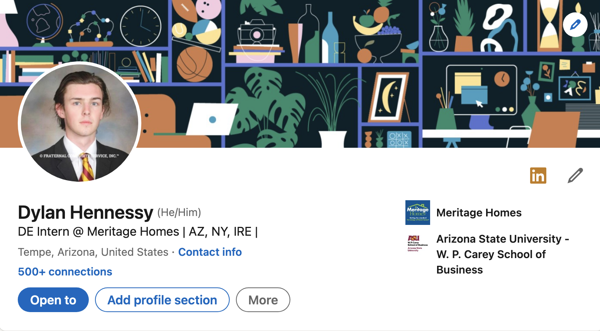
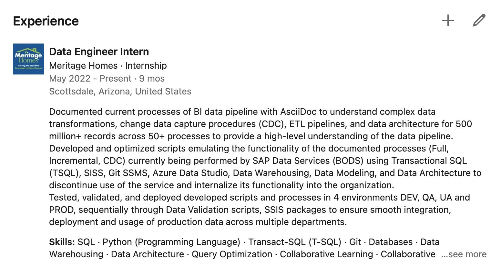

= Kappa Alpha

Dylan Hennessy <hennessydylan@outlook.com>
v1.0, 2023-01-16

== LinkedIn Basics

=== Why have a good LinkedIn?
In General:: The most popular way now to place anyone for any type of competitive job is through working with a recruiter from that specific company, cold applying unless you are a top applicant isn't going to get you anywhere in most cases. *Reaching out and building a relationship with these recruiters who are the lead on a specific job that you want is how you get recruiters to fight for you when they are deciding to hire and who to interview in the first place.* If you have a blank linkedin and try to reachout you won't even get a response when trying to connect.
For business students:: In essentially every single job that finance, accounting, consulting, venture capital, etc. career feilds offer that have any sort of prestige, won't even give you an interview if you don't know someone, or aren't from a top school with perfect grades, and frankly we go to Arizona State. Not single one of us has a chance against someone from an ivy leauge school unless we have someone that works there already who is willing to fight for us. *A good profile is a tool to meet a build relationships with people where you want to work now and in the future.*

=== Bare Minimum
Professional Photo:: It is common to just use your fraternity composite as your profile photo.
Profile Header:: Fill out all your neccesary information, this will be seen under your name on all your Linkedin interactions so don't make it unprofessional. You can follow my format below or just use "Position at company"

.Profile Photo & Header Example
[%collapsible]
====

====

Summary Section:: Your summary section is very important but it is something that is personalized and that you need to write yourself. Keep it professional, you can take the route of finding a template for it online aswell https://www.themuse.com/advice/5-templates-thatll-make-writing-the-perfect-linkedin-summary-a-breeze[here]. 

Previous Experience and Descriptions:: *This is the most important part of your profile.* The easiest way to do this is to copy and paste what you have on your resume for each of your specific job. *These points should be written in the S.T.A.R method, three per job. If you do not know what S.T.A.R. method is https://www.youtube.com/embed/wupgSKRwL7Y[here] is a good video that will show you how to write correct resume points.* What is written in these points is how recruiters are going to be searching for and finding you on linkedin.

.Previous Experiences and Descriptions Example
[%collapsible]
====

====

Skills and Skills Assesments:: It is important also to have your skills actually selected and configured because like your previous job descriptions, what you choose for your skills is also a search field that is possible for recruiters to search for. *There are also the linkedin skills assessments, out of the kindness of my heart I have provided you a link to the answerkey to most if not all of the skills assessments on linkedin https://github.com/Ebazhanov/linkedin-skill-assessments-quizzes[here], you should get in the top percentage ranking for each that you have on your profile.*. One thing that I would stay away from is blindly lying and saying that you have a skill when you don't, it will make you look like an idiot in an interview. The linkedin skills assesments are generally not what a job is actually like so if you have actually some base level or more above on a skill then put it on your profile and pass the test.

